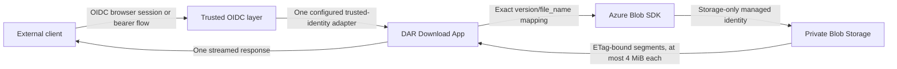

# DAR Download App

Small Go service for streaming exact, authenticated downloads from private Azure Blob Storage.
A separately deployed OIDC authentication layer verifies the customer login or token before
private app ingress. The default adapter accepts one provider-neutral issuer and subject pair.
Two explicitly enabled Azure Container Apps adapters instead validate platform-reserved
principal representations. `azure_container_apps` maps one Entra tenant-bound object ID;
`azure_container_apps_oidc` maps one custom OpenID Connect provider's protected principal ID.
Both produce the same internal identity model. After authentication, every valid identity may
download every valid exact Blob path in the configured container.

This repository contains only product source, tests, API/configuration contracts, container
packaging, and security/release automation. Identity-provider deployment, cloud resources,
networking, DNS, RBAC, storage provisioning, and application deployment belong in a separate
platform repository.



The app does not implement an authorization-code flow, validate customer bearer or session
tokens, list the container, accept nested or encoded Blob paths, mint SAS URLs, mount Blob
Storage, accept storage keys, or reuse customer authority for storage. Exactly one
trusted-identity mode is active at a time, and direct ingress that bypasses its authentication
layer is forbidden.

## HTTP contract

- `GET /healthz` is anonymous liveness and never calls identity or storage dependencies.
- `GET /v1/releases/<version>/download/<file_name>` authenticates first, then maps the two
  validated raw ASCII segments exactly to `<version>/<file_name>` in the fixed container.
- Every authenticated identity may access every valid exact Blob path in that container. There
  is no subject, version, or filename allowlist; filenames are not a security boundary.
- In `oidc_headers` mode, `X-DAR-OIDC-Issuer` and `X-DAR-OIDC-Subject` are internal
  trusted-boundary inputs. In `azure_container_apps` mode, the app accepts only the
  platform-reserved Container Apps principal representation and rejects caller `X-DAR-*`
  assertions. `azure_container_apps_oidc` applies the same private boundary to one exact custom
  provider name and opaque platform principal ID. None of these internal representations is a
  public credential or OpenAPI parameter.
- Full downloads and one byte range are supported. Object reads are bound to the observed strong
  ETag, sequential, and capped at 4 MiB per storage request.
- All other routes and methods are denied with bounded responses.

See [the OpenAPI contract](api/openapi.yaml) and
[the runtime configuration contract](docs/configuration.md).

## Local validation

Prerequisites are Docker, `mise`, `curl`, `jq`, and `tar`. The bootstrap downloads exact tool
versions, verifies release-asset checksums, and pulls digest-pinned Semgrep and ZAP images.

```bash
make bootstrap
make test
make candidate IMAGE_REF=dar-download-app:local
```

`make candidate` is deliberately ordered:

1. Secret scanning, correctness checks, tests, coverage, race detection, bounded fuzzing,
   dependency analysis, SAST, and filesystem scanning run before an image can be built.
2. The source digest is bound to the image build.
3. The exact Linux AMD64 image receives two vulnerability scans, two SBOM formats,
   image-and-binary architecture checks, minimal-image policy checks, read-only runtime smoke
   tests, and local OWASP ZAP DAST.

Passing these checks means no required scanner found a known release-blocking issue in that
candidate. It does not prove absolute security. A separately authorized authenticated staging
penetration test is required before production promotion.

## Runtime configuration

The service fails startup unless all required values are valid:

| Variable | Purpose |
| --- | --- |
| `DAR_DOWNLOAD_TRUSTED_IDENTITY_MODE` | Optional trusted adapter: `oidc_headers` (default), `azure_container_apps`, or `azure_container_apps_oidc` |
| `DAR_DOWNLOAD_OIDC_ISSUER` | Exact HTTPS issuer expected from the trusted OIDC layer |
| `DAR_DOWNLOAD_OIDC_PROVIDER_NAME` | Exact custom provider name required only by `azure_container_apps_oidc` |
| `DAR_DOWNLOAD_AZURE_CONTAINER_APPS_TENANT_ID` | Required canonical tenant UUID only in `azure_container_apps` mode |
| `DAR_DOWNLOAD_STORAGE_ACCOUNT_NAME` | Private Blob account name |
| `DAR_DOWNLOAD_STORAGE_CONTAINER` | Fixed release container |
| `DAR_DOWNLOAD_MANAGED_IDENTITY_CLIENT_ID` | Dedicated storage identity client UUID |
| `DAR_DOWNLOAD_PORT` | Optional listener port; defaults to `8000` |

The retired `DAR_DOWNLOAD_RELEASES_JSON` setting is rejected if supplied so stale deployments
fail closed. See the [configuration contract](docs/configuration.md) for exact path parsing and
identity-boundary rules.

## Custom OIDC through Container Apps

The current Entra POC remains in `azure_container_apps` mode. Do not add the custom-provider
variables or replace its Entra auth configuration. The following example is for a separate,
approved deployment that uses Duende IdentityServer through Azure Container Apps Authentication.
Container Apps—not the Go process—is the confidential OIDC client and owns discovery, redirects,
the callback, Authorization Code exchange, token validation, and the authenticated session.

### Go container settings

Configure only the provider-neutral trust label and exact Container Apps provider alias:

```text
DAR_DOWNLOAD_TRUSTED_IDENTITY_MODE=azure_container_apps_oidc
DAR_DOWNLOAD_OIDC_ISSUER=https://identity.example.com
DAR_DOWNLOAD_OIDC_PROVIDER_NAME=DuendePOC
DAR_DOWNLOAD_STORAGE_ACCOUNT_NAME=<storage-account>
DAR_DOWNLOAD_STORAGE_CONTAINER=<container>
DAR_DOWNLOAD_MANAGED_IDENTITY_CLIENT_ID=<canonical-storage-identity-client-uuid>
DAR_DOWNLOAD_PORT=8000
```

`DAR_DOWNLOAD_AZURE_CONTAINER_APPS_TENANT_ID` must be absent in this mode. Do not add an OIDC
client ID, client secret, endpoint, cookie, callback, or token to the Go environment, image,
request headers, or logs.

### Container Apps Authentication settings

First create a dedicated Container Apps secret through the approved platform secret-delivery
path. The example below references its name and never accepts the secret value on the command
line. Replace every angle-bracketed value and run it only against the intended custom-OIDC app:

```bash
az containerapp auth openid-connect add \
  --resource-group <resource-group> \
  --name <container-app> \
  --provider-name DuendePOC \
  --client-id <dedicated-duende-client-id> \
  --client-secret-name <existing-container-app-secret-name> \
  --openid-configuration \
    https://identity.example.com/.well-known/openid-configuration \
  --scopes openid \
  --yes

az containerapp auth update \
  --resource-group <resource-group> \
  --name <container-app> \
  --enabled true \
  --require-https true \
  --unauthenticated-client-action RedirectToLoginPage \
  --redirect-provider DuendePOC \
  --excluded-paths /healthz \
  --token-store false \
  --yes
```

The general callback form is
`https://<container-app-fqdn>/.auth/login/<provider-name>/callback`. The exact callback registered
for this Duende example is:

```text
https://<container-app-fqdn>/.auth/login/DuendePOC/callback
```

Microsoft requires a unique alphanumeric provider name. `DuendePOC` must therefore match
`DAR_DOWNLOAD_OIDC_PROVIDER_NAME`, the callback segment, the Container Apps provider key, and the
protected principal's provider evidence byte for byte. See Microsoft's
[custom OpenID Connect setup](https://learn.microsoft.com/azure/container-apps/authentication-openid)
and [Container Apps authentication boundary](https://learn.microsoft.com/azure/container-apps/authentication).

### Duende IdentityServer client

Create one dedicated confidential interactive client. Configure these Duende `Client` values in
the identity-server-owned configuration store:

| Duende setting | Required value |
| --- | --- |
| `ClientId` | The dedicated value supplied to Container Apps; never a Go setting |
| `RequireClientSecret` | `true` |
| `ClientSecrets` | A securely generated, rotated server-side secret verifier corresponding to the Container Apps secret |
| `AllowedGrantTypes` | `GrantTypes.Code` only; do not add `client_credentials` |
| `RequirePkce` | `false` only for the initial ACA compatibility POC; re-enable after verified interoperability before production |
| `RedirectUris` | The one exact HTTPS callback above; no wildcard or alternate host |
| `AllowedScopes` | `openid`, plus only individually justified identity claims |
| `AllowOfflineAccess` | `false` |
| `AllowAccessTokensViaBrowser` | `false` |

The Duende issuer and discovery document's `issuer` must byte-exact-match
`DAR_DOWNLOAD_OIDC_ISSUER`, including any trailing slash. The identity server must return a stable
authenticated user identity; the Go adapter deliberately uses the protected Container Apps
principal ID and does not guess claim aliases. See Duende's
[client configuration reference](https://docs.duendesoftware.com/identityserver/reference/models/client/).

After configuration, read back the auth resource and prove that authentication is required,
HTTPS is required, only `/healthz` is excluded, token storage is disabled, the metadata issuer
and audience are exact, and the client credential appears only as a secret reference. A real
browser login is still required; local Go tests cannot prove the live OIDC exchange.

## Further guidance

- [Operations and trusted OIDC integration](docs/operations.md)
- [Security gates and evidence](docs/security-gates.md)
- [Requirement-to-evidence map](docs/assurance-map.md)
- [Threat model](docs/threat-model.md)
- [Private GitHub repository setup](docs/github-setup.md)
- [Vulnerability reporting](SECURITY.md)
