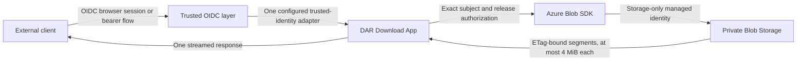

# DAR Download App

Small Go service for streaming explicitly authorized DAR releases from private Azure Blob
Storage. A separately deployed OIDC authentication layer verifies the customer login or token
before private app ingress. The default adapter accepts one provider-neutral issuer and subject
pair. An explicitly enabled Azure Container Apps adapter instead validates the platform-reserved
principal headers and maps one tenant-bound object ID into the same internal issuer-and-subject
model. The app checks that identity against a per-release subject allowlist before using its
storage-only managed identity.

This repository contains only product source, tests, API/configuration contracts, container
packaging, and security/release automation. Identity-provider deployment, cloud resources,
networking, DNS, RBAC, storage provisioning, and application deployment belong in a separate
platform repository.



The app does not implement an authorization-code flow, validate customer bearer or session
tokens, accept Blob paths from customers, mint SAS URLs, mount Blob Storage, accept storage
keys, or reuse customer authority for storage. Exactly one trusted-identity mode is active at a
time, and direct ingress that bypasses its authentication layer is forbidden.

## HTTP contract

- `GET /healthz` is anonymous liveness and never calls identity or storage dependencies.
- `GET /v1/releases/<opaque-release-id>/download` returns the configured `.dar` file only after
  exact issuer and subject authorization.
- In `oidc_headers` mode, `X-DAR-OIDC-Issuer` and `X-DAR-OIDC-Subject` are internal
  trusted-boundary inputs. In `azure_container_apps` mode, the app accepts only the
  platform-reserved Container Apps principal representation and rejects caller `X-DAR-*`
  assertions. Neither internal representation is a public credential or OpenAPI parameter.
- Full downloads and one byte range are supported. Object reads are bound to the observed strong
  ETag, sequential, and capped at 4 MiB per storage request.
- All other routes and methods are denied with bounded responses.

See [the OpenAPI contract](api/openapi.yaml) and
[the runtime configuration contract](docs/configuration.md).

## Local validation

Prerequisites are Docker, `mise`, `curl`, `jq`, and `tar`. The bootstrap downloads exact tool
versions, verifies release-asset checksums, and pulls digest-pinned Semgrep and ZAP images.

```bash
make bootstrap
make test
make candidate IMAGE_REF=dar-download-app:local
```

`make candidate` is deliberately ordered:

1. Secret scanning, correctness checks, tests, coverage, race detection, bounded fuzzing,
   dependency analysis, SAST, and filesystem scanning run before an image can be built.
2. The source digest is bound to the image build.
3. The exact Linux AMD64 image receives two vulnerability scans, two SBOM formats,
   image-and-binary architecture checks, minimal-image policy checks, read-only runtime smoke
   tests, and local OWASP ZAP DAST.

Passing these checks means no required scanner found a known release-blocking issue in that
candidate. It does not prove absolute security. A separately authorized authenticated staging
penetration test is required before production promotion.

## Runtime configuration

The service fails startup unless all required values are valid:

| Variable | Purpose |
| --- | --- |
| `DAR_DOWNLOAD_TRUSTED_IDENTITY_MODE` | Optional trusted adapter: `oidc_headers` (default) or `azure_container_apps` |
| `DAR_DOWNLOAD_OIDC_ISSUER` | Exact HTTPS issuer expected from the trusted OIDC layer |
| `DAR_DOWNLOAD_AZURE_CONTAINER_APPS_TENANT_ID` | Required canonical tenant UUID only in `azure_container_apps` mode |
| `DAR_DOWNLOAD_STORAGE_ACCOUNT_NAME` | Private Blob account name |
| `DAR_DOWNLOAD_STORAGE_CONTAINER` | Fixed release container |
| `DAR_DOWNLOAD_MANAGED_IDENTITY_CLIENT_ID` | Dedicated storage identity client UUID |
| `DAR_DOWNLOAD_RELEASES_JSON` | Strict opaque release-to-Blob and subject policy |
| `DAR_DOWNLOAD_PORT` | Optional listener port; defaults to `8000` |

The release policy is authorization-sensitive configuration, not a credential. Do not place
customer identifiers or live policy values in this repository or CI logs. See the
[configuration contract](docs/configuration.md) for exact parsing and boundary rules.

## Further guidance

- [Operations and trusted OIDC integration](docs/operations.md)
- [Security gates and evidence](docs/security-gates.md)
- [Requirement-to-evidence map](docs/assurance-map.md)
- [Threat model](docs/threat-model.md)
- [Private GitHub repository setup](docs/github-setup.md)
- [Vulnerability reporting](SECURITY.md)
