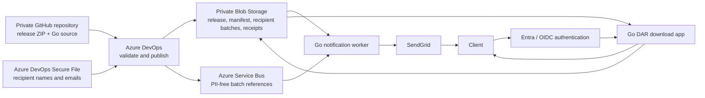

# DAR Release Distribution

One private product repository for publishing, notifying, and downloading DAR releases. The
runtime components and release publisher are Go; CI/CD runs in Azure DevOps.

## End-to-end flow



The production deployment has two application containers:

- `dar-download`: authenticates through the hosting platform and streams an exact private Blob.
- `dar-distribution-worker`: consumes Service Bus, verifies immutable manifests and protected
  recipient batches, sends through SendGrid, and writes per-recipient receipts.

`dar-release-publisher` is a pipeline command, not a continuously running service. The former
mail-stub container is not part of the production deployment.

## Repository layout

```text
cmd/
├── dar-download/
├── dar-distribution-worker/
└── dar-release-publisher/
internal/
├── publication/
└── distribution/
azure-pipelines/
├── ci.yml
└── dar-release-distribution.yml
releases/
└── vA.B.C.DD/dar-A.B.C.DD.zip
recipients/
└── notification-recipients.example.csv
```

Azure resources, Entra configuration, networking, DNS, secrets, live recipient data, deployment
state, and production promotion authority remain outside Git. This repository supplies the
images, publisher, pipeline definitions, contracts, and operating instructions.

## Release input

The product team commits one canonical ZIP:

```text
releases/v8.31.1.05/dar-8.31.1.05.zip
```

The ZIP must contain exactly one non-empty `.dar` and may include bounded `.pdf`, `.docx`, `.md`,
or `.txt` guides. The pipeline derives the manifest; do not commit one.

Production recipient names and emails are an Azure DevOps Secure File, not a repository file.
See [release input](releases/README.md) and [recipient input](recipients/README.md).

## Local validation

The normal fast suite is:

```bash
go test ./...
```

The complete candidate gate requires Docker, `mise`, `curl`, `jq`, and `tar`:

```bash
make bootstrap
make candidate IMAGE_REF=dar-download-app:local
```

It runs secret scanning, static checks, tests, coverage, race detection, bounded fuzzing,
dependency and source analysis before building. It then generates SBOMs and scans the exact
download and worker images. It verifies both non-root minimal runtimes and runs local DAST against
the download image. The no-ingress worker's live Azure and SendGrid dependencies remain a staging
test. Passing local gates does not authorize a production deployment.

## Access boundary

- `/healthz` is anonymous liveness.
- `/v1/releases/<version>/download/<file_name>` requires the configured trusted Entra/OIDC
  boundary and maps exactly to `<version>/<file_name>` in one fixed private container.
- There is no database or per-release entitlement query. The identity platform must restrict
  application assignment to the intended client population. Every accepted identity can access
  every valid release in that deployment's container.
- Blob access uses a dedicated managed identity. The browser receives no Blob URL, SAS, key, or
  storage token.

## Production boundary

Do not promote directly from this branch. Production requires all of the following:

1. Azure DevOps is connected to this private GitHub repository.
2. The protected recipient Secure File, non-secret variable group, private agent pool, workload-
   federated service connection, and protected environment are configured.
3. The download and worker images pass the organization’s image signing and promotion workflow.
4. A staging run proves Entra login, private Blob access, Service Bus processing, SendGrid test
   delivery, receipt persistence, download audit events, and byte integrity using test data.
5. The exact image digests and Azure configuration are reviewed before production promotion.

See:

- [Architecture diagrams](docs/architecture/README.md)
- [Runtime configuration](docs/configuration.md)
- [Release distribution operations](docs/release-distribution.md)
- [Repository migration and rollback](docs/migration.md)
- [Trusted OIDC and download operations](docs/operations.md)
- [Azure DevOps setup](docs/azure-devops-setup.md)
- [Security gates](docs/security-gates.md)
- [Threat model](docs/threat-model.md)
- [Vulnerability reporting](SECURITY.md)
