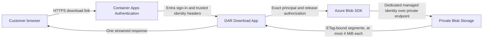

# DAR Download App

Small Go service for streaming explicitly authorized DAR releases from private Azure Blob
Storage. Azure Container Apps Authentication performs the Microsoft Entra sign-in. This
service independently verifies the trusted Easy Auth identity, checks an exact per-release
principal allowlist, and reads the configured Blob with its own managed identity.

This repository contains only application source, tests, API/configuration contracts, the
container build, and security/release automation. Azure, Entra, networking, DNS, RBAC, storage,
and Container Apps deployment configuration belong in a separate platform repository.



The app does not accept Blob paths from customers, mint SAS URLs, mount Blob Storage, accept
storage keys, or reuse the customer's token for storage. An authenticated user is still denied
unless their exact principal ID is allowed for the requested opaque release ID.

## HTTP contract

- `GET /healthz` is anonymous liveness and never calls storage.
- `GET /v1/releases/<opaque-release-id>/download` returns the configured `.dar` file.
- Full downloads and one byte range are supported. Object reads are bound to the observed strong
  ETag, sequential, and capped at 4 MiB per storage request.
- All other routes and methods are denied with bounded responses.

See [the OpenAPI contract](api/openapi.yaml) and
[configuration contract](specs/001-secure-dar-download/contracts/configuration.md).

## Local validation

Prerequisites are Docker, `mise`, `curl`, `jq`, and `tar`. The bootstrap downloads exact tool
versions, verifies release-asset checksums, and pulls digest-pinned Semgrep and ZAP images.

```bash
make bootstrap
make test
make candidate IMAGE_REF=dar-download-app:local
```

`make candidate` is deliberately ordered:

1. Secret scanning, correctness checks, tests, coverage, race detection, bounded fuzzing,
   dependency analysis, SAST, and filesystem scanning run before an image can be built.
2. The source digest is bound to the image build.
3. The exact Linux AMD64 image receives two vulnerability scans, two SBOM formats,
   image-and-binary architecture checks, minimal-image policy checks, read-only runtime smoke
   tests, and local OWASP ZAP DAST.

Passing these checks means no required scanner found a known release-blocking issue in that
candidate. It does not prove absolute security. A separately authorized authenticated staging
penetration test is required before production promotion.

## Runtime configuration

The service fails startup unless all required values are valid:

| Variable | Purpose |
| --- | --- |
| `HARMONY_DAR_TENANT_ID` | Exact Entra tenant UUID expected in trusted identity evidence |
| `HARMONY_DAR_STORAGE_ACCOUNT_NAME` | Private Blob account name |
| `HARMONY_DAR_STORAGE_CONTAINER` | Fixed release container |
| `HARMONY_DAR_MANAGED_IDENTITY_CLIENT_ID` | Dedicated user-assigned identity client UUID |
| `HARMONY_DAR_RELEASES_JSON` | Strict opaque release-to-Blob and principal policy |
| `HARMONY_PORT` | Optional listener port; defaults to `8000` |

The release policy is configuration, not a credential, but it is authorization-sensitive. Do
not place customer identifiers or live policy values in this repository or CI logs.

## Further guidance

- [Operation and Container Apps integration](docs/operations.md)
- [Security gates and evidence](docs/security-gates.md)
- [Requirement-to-evidence map](docs/assurance-map.md)
- [Threat model](docs/threat-model.md)
- [Private GitHub repository setup](docs/github-setup.md)
- [Vulnerability reporting](SECURITY.md)
- [Feature specification](specs/001-secure-dar-download/spec.md)
